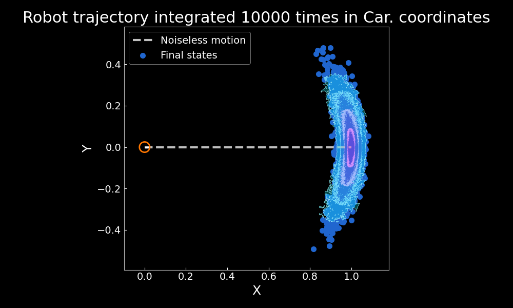
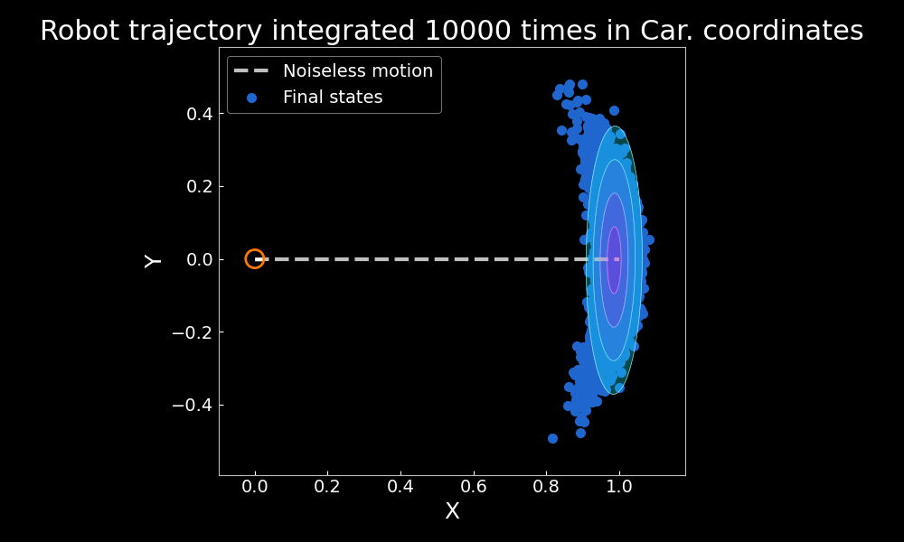
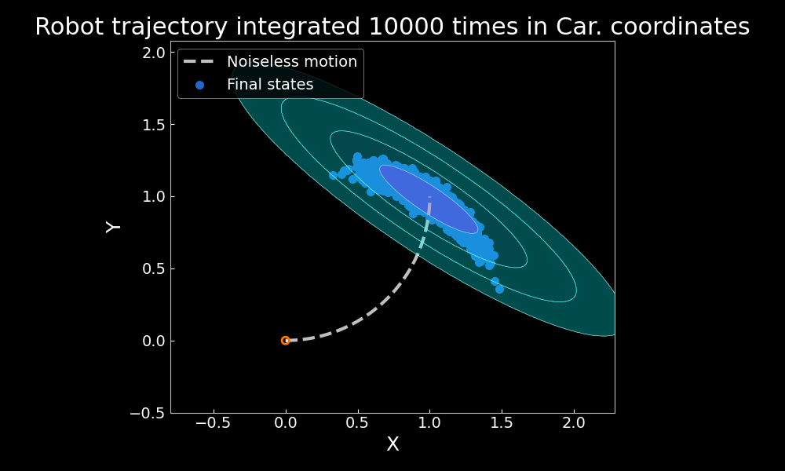
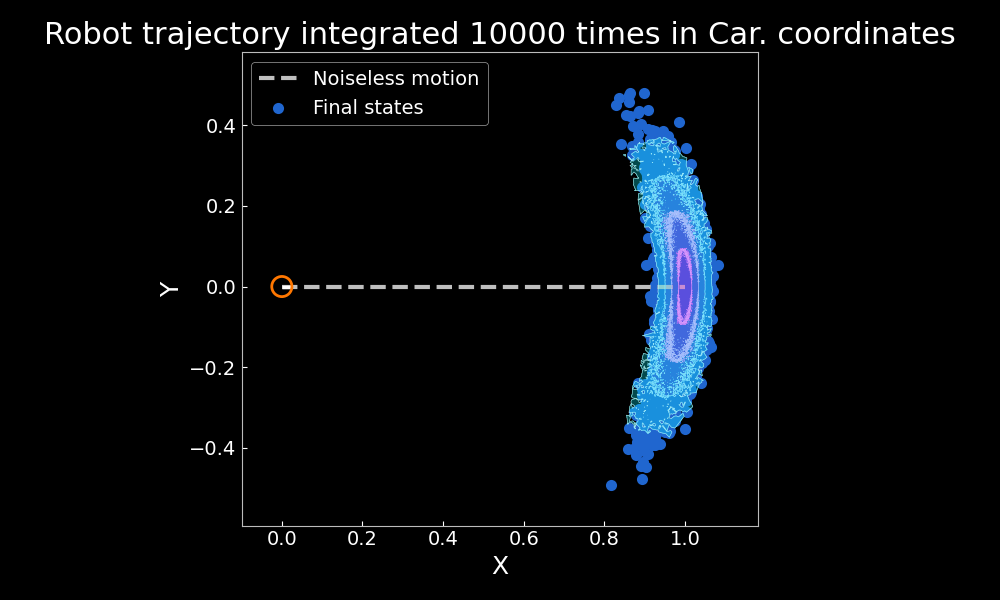
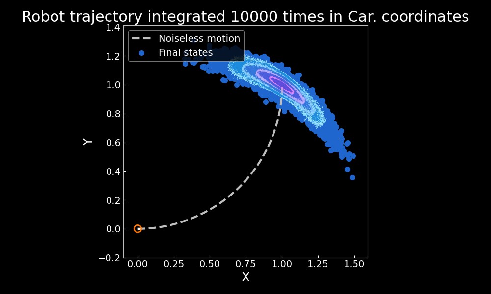

# Banana shape distribution

This repository is a Python implementation of [The Banana Distribution is Gaussian:
A Localization Study with Exponential Coordinates](http://www.roboticsproceedings.org/rss08/p34.pdf). Particularly, it addresses all the sections of the paper but section VII. 

<div  class="center">
    
</div>

## Installation

To run the project install its requirements as follows.

```bash
pip3 install -r requirements.txt
```

## Defining distributions in Exp. Coordinates.

To launch the distribution experiment, run the next command.

```bash
python3 distribution.py --D=1 --n_trials=10000 --mov=linear
```

The parameter `D` corresponds to a noise coefficient, `n_trials` is the number of times the trajectory is integrated and `mov` is the type of displacement, either an arc or linear. Results demonstrating the distribution modelled in cartesian and exponential coordinates is presented.

|        |                   Cartesian                    |               Exponential                |
|:------:|:----------------------------------------------:|:----------------------------------------:|
| Linear |  |  |
|  Arc   |     |     |

## Propagating distribution in Exponential coordinates

To run the propagation experiment, execute the next command. Nota that the arguments are the same ones explained before.

```bash
python3 propagation.py --D=1 --n_trials=10000 --mov=arc
```

|        |           Exponential (Monte Carlo)            |           Exponential (Propagation)           |
|:------:|:----------------------------------------------:|:---------------------------------------------:|
| Linear |  |  |
|  Arc   |     |     |